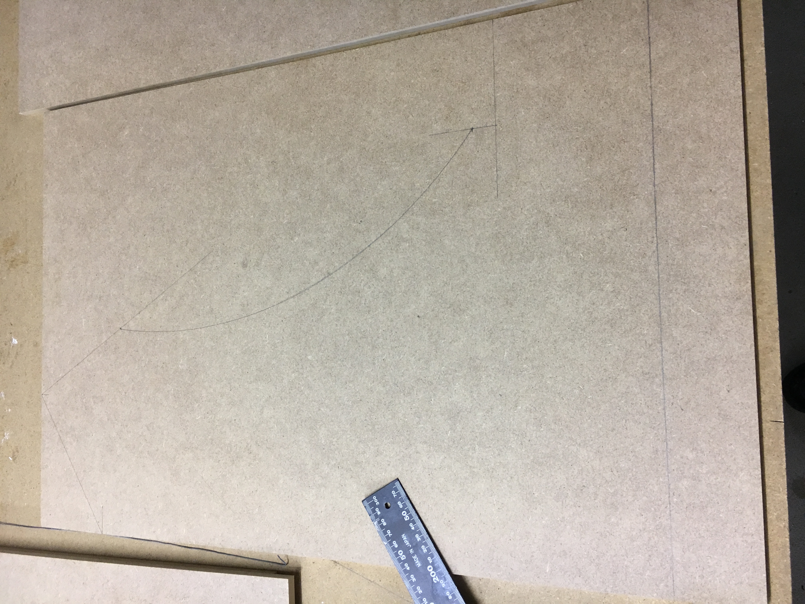
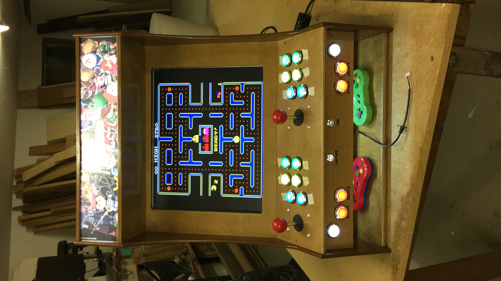
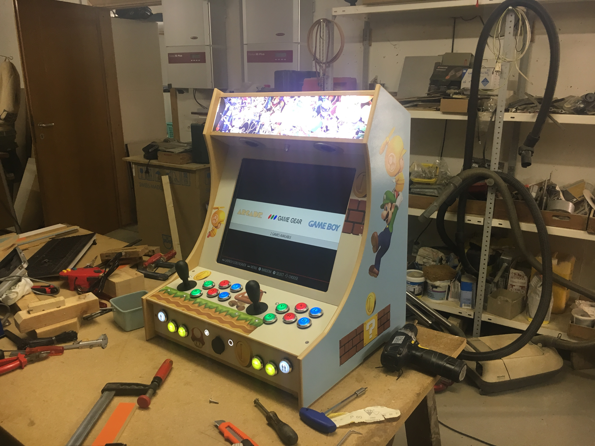
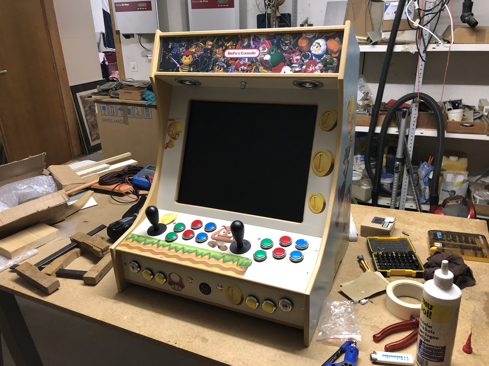
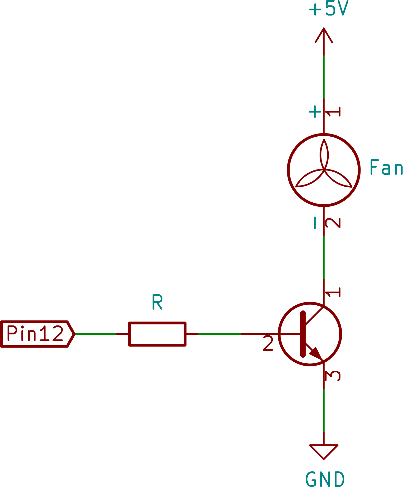

# DIY Arcade Cabinet

## 1. My experience, my passion... my story

### 1.1 TL;DR

I want to introduce this project by telling my story to explain why the below information are not 100% complete. It is up to everyone, according to their choices and the material they have, etc. to apply the right corrective to obtain their own *customized* Cabinet.

I basically made 2 types of arcade: one with the Raspberry and the other with a PC.

#

My passion for Cabinets began a few years ago when a colleague showed me a video where a guy was roughly explained how to build an 80's video game. Needless to say, from that precise moment a strong desire to build one on my own was born inside me.

After viewing several videos and reading many tutorials, I started my adventure from a project found on the internet, from which I applied the necessary changes to my needs.

Thanks to friend’s help, after four months of hard work, the first Arcade was complete and functional. Inside it a Raspberry Pi 3 B powered by a standard PSU, which was also indispensable to power the marquee's LEDs, buttons' LEDs and the amplifier, was striving for the best. This first Arcade became a gift for a friend for his birthday.

After the first Cabinet, my friend also started being passionate about it and quickly recovered 12mm MDF planks already colored and lacquered on one side that would otherwise have been disposed of. All these semi-ready planks have definitely simplified the construction of following Arcades.

At this point the rumor spread out within our circle of friends and we were asked for a second Cabinet for another birthday present. This time the result was definitely more scenic thanks to the new wooden planks and the Mario's and Luigi’s stickers.

The construction’s time was just over a month! The internal structure was practically identical to the first one, except for the Raspberry, which was a Pi 3 B+ and the amplifier.

The third one was finally for us, or better to say, for my friend who helped me build them. He chose to create only the game plan without integrating the screen to use it with the TV. After a first case's redesign, we completed it quickly by doing a couple of changes. We added an Arduino to manage the PSU, the Raspberry and the front on / off buttons (including LEDs).

The last two Cabinets were the most complex and time consuming. But before talking about the technical choices I want to end the story. Once the third Arcade was completed, I showed the photos to my cousin, who is nerdier than me... so the last two Arcades were born: one for me (the fourth) and one for him (the fifth). In this case, however, with a stroke of good luck I managed to find two HP Compaq Elite 8300 Small Form Factor that were no longer used, which we used to replace the Raspberry Pi. The biggest challenge, although it may not seem like it, was managing the interior space. The poor HPs have been "shelled" to significantly reduce the size.

In this case, the Arduino, in addition to managing the lighting and the front buttons, is used to interface with the PC (switch it on, switch it off and understand if it is on).

## 2. My shopping list

As the section says, this is my shopping list you have to adopt and adapt as mentioned before. The same goes for the kinds of material and not just for the list itself.

The cables, the monitor, the power supply, the Raspberry Pi (and also the SD Card), the wooden planks and the screws are excluded from this list.

- [Aux Cable 3.5mm](https://www.aliexpress.com/item/32799612534.html)
- [5V 2-Channel Relay Module](https://www.aliexpress.com/item/1726504761.html)
- [Joystick And Illuminated Buttons](https://www.aliexpress.com/item/32802891516.html)
- [LED Strip Tape 12V](https://www.aliexpress.com/item/32766632091.html)
- [Dual USB 3.0 Extension](https://www.aliexpress.com/item/32824087096.html)
- [Amplifier Board 5V-24V](https://www.aliexpress.com/item/32764875134.html)
- [Power Button with LED 5V Self-reset Momentary](https://www.aliexpress.com/item/32676085681.html)
- [Push Button Ring LED 5V Self-reset Momentary](https://www.aliexpress.com/item/32676526568.html)
- [Arduino Nano](https://www.aliexpress.com/item/32341832857.html)
- [Loudspeakers 3Inch](https://www.aliexpress.com/item/32765784062.html)
- [Super Mario Sticker](https://www.aliexpress.com/item/32657752770.html)
- [230V Socket With Fuse](https://www.aliexpress.com/item/32652997258.html)
- [Female & Male Plug Connectors](https://www.aliexpress.com/item/32649026625.html)
- [Two Paired Screw Terminals](https://www.aliexpress.com/item/32844514194.html)
- [Crimp Terminal Female & Male](https://www.aliexpress.com/item/32839409560.html)

Only for Raspberry Pi variant

- [HDMI to VGA Adapter](https://www.aliexpress.com/item/32756145343.html)
- [Raspberry Pi 3 Aluminium Heatsink](https://www.aliexpress.com/item/32686507416.html)
- [Raspberry Pi Case](https://www.aliexpress.com/item/32718435597.html)

Only for PC variant

- [Bluetooth Dongle Adapter](https://www.aliexpress.com/item/32696756077.html)
- [Splice Wire Wiring Connector](https://www.aliexpress.com/item/32796744792.html)
- [SATA Power Cable Splitter](https://www.aliexpress.com/item/32802655203.html)

## 3. Build the Cabinet case

The building instruction and details refer to the [source of this project](https://www.instructables.com/id/2-Player-Bartop-Arcade-Machine-Powered-by-Pi). I want to take the opportunity to thank the author because in addition to having made a complete guide, it has inspired me for several solutions.

Here you can find the original project's PDFs, in addition there is a [more detailed PDF](./templates/dimensions/dimensions.pdf) with all needed measures.

## 4. Arcade's Core - General wiring diagram

Depending on what you choose - Raspberry Pi or PC - the wiring diagram is slightly different. The same considerations also apply to this section: everyone can indulge themselves and add / remove functionality, simplify or modify my scheme to adapt it to his project.

_I used KiCad to build the scheme_

### 4.1 PC Scheme

[PC Scheme Document](./schemes/pc/pc-schema.pdf)  
The Arduino has the task of interacting between the user (player in this case), the PC, the PSU, the screen, the two front on/off buttons and the lighting.
The PSU has two types of 5 V: one has more power (5V SB) and there has less (5V), which is activated even when the PSU is in sleep mode. The Arduino, which consumes a few amps and must always be powered on to read the state of the front power button, it is powered by the 5V of the PSU (red cable).  
The module consists on two relays. The former is used to manage the multiple LEDs, which cannot be connected directly to the Arduino due to the limits of the current supplied. The latter manage the monitor (on/off), which, thanks to the wiring, it turns on automatically when the module is powered and vice versa. This module does not require much electric current, but to avoid it from staying on when the PSU is in sleep mode, it is powered by the 5V SB (purple cable).  
The Arduino is connected directly with the PC's power button to simulate (electronically) its pressure via the front button.  
Finally, in order to know the status of the PC, the PSU is connected to the Arduino via the green cable (PS ON) managed by the PC motherboard.

### 4.2 Raspberry Pi Scheme

[Raspberry Pi Scheme Document](./schemes/raspberry/raspberry-schema.pdf)  
In this case, the big change, compared to the previous scheme, is obviously the interaction with the Raspberry.
Once powered, the Raspberry turns on automatically, but it cannot be turned off via a button. However, the GPIO (general-purpose input/output) that can be managed by phyton script comes in handy. Thanks to the script, via the GPIO3 pin, it is possible to switch it off from the Arduino.
Unlike the PC, the PSU is managed entirely by the Arduino (via the green cable: PS ON). Unfortunately, the Raspberry does not provide its status (on or sleep mode), but always via script (GPIO21) it is possible to know if the script is running or not (useful for the lighting effects of the two front buttons).  
If the Raspberry gets too hot during game sessions, a fan can be connected.  

## 5. Arduino "OS"

We have added simple effects to the LEDs of the on/off and lighting buttons thanks to the introduction of the Arduino. This process has achieved a more complete result in the Raspberry version, taking advantage of its potential of GPIO pins. The downside of this version is the lack of an off Raspberry’s signal, which has forced the introduction of a delay after which the Raspberry is considered off and the PSU can be turned off.

Dependending on the choice (PC or Raspberry) into `src/` you will find the correspondig Arduino's "OS".

## 6. Software - Main OS

### 6.1 PC

The only system I have used is Recalbox. Basically it is a free OS to install on HDD (or SSD) that allows you to start playing immediately. The only thing to know is that the controller must be configured after the first boot. The UI is user-friendly and the games are loaded through the network. For more information refer to the [official website](https://www.recalbox.com).

### 6.2 Raspberry Pi (3 B / 3 B+)

#### 6.2.1 Main OS

In this case I tried 3 systems: RetroPie, Recalbox and Batocera.linux.

Retropie is the most flexible and configurable, but for this reason it is also the most complicated and least intuitive. Certainly, better performances can be obtained compared to competitors, but out of the box is limited and *practically* unusable from Nintendo 64 up.

Recalbox, as mentioned in the PC's section, is much more immediate and easier to use.

Batocera.linux is a Recalbox's fork, with the intent of being more responsive in keeping it updated. If you want an easy and immediate solution for the Raspberry Pi’s latest versions, it is often the only choice.

#### 6.2.2 GPIO Scripts

To install the necessary script into Raspberry:

1. Install GPIO Zero Python library and Git:  
   `sudo apt install python-gpiozero git`
2. Clone this repo to your Raspberry Pi:  
   `git clone https://github.com/dafo90/diy-arcade-cabinet.git`
3. Go to project directory:  
   `cd diy-arcade-cabinet`
4. Install scripts:  
   `./install.sh`
